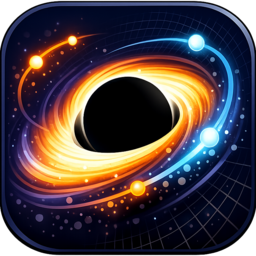
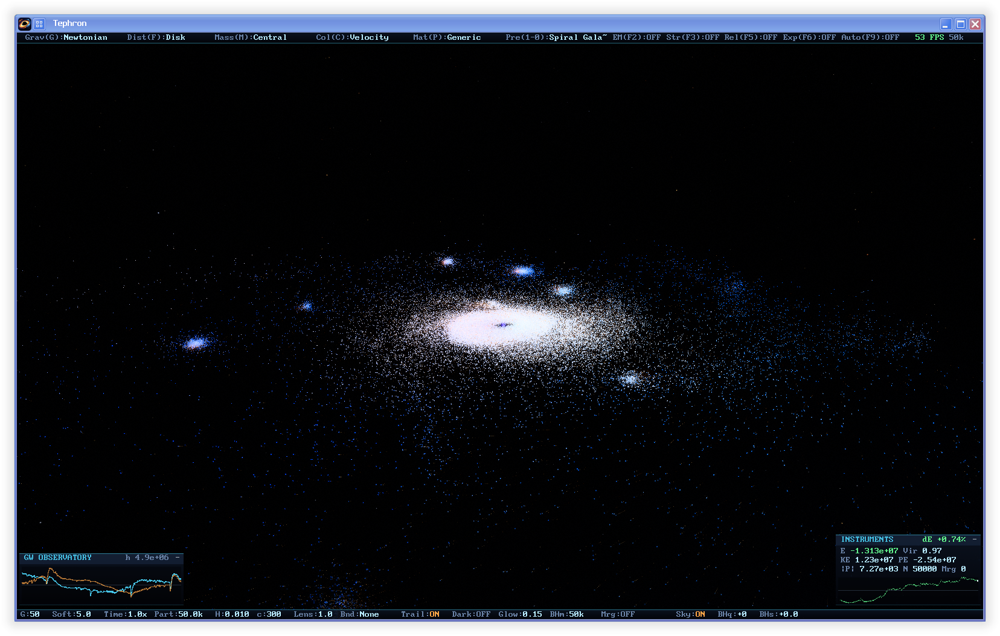

<p align="center"></p>

# Tephron

*Named for tephra — everything a volcano hurls at the sky — wearing the **-on** of the force carriers.*

**Tephron** is a real-time N-body particle simulator built with Vulkan compute shaders. Simulates gravitational, electromagnetic, and nuclear forces with volumetric glow rendering, gravitationally lensed black holes, and a live conservation-law instrument panel.

## Gravitational Lensing Demo

[](assets/gallery/edge-on-quasar.mp4)

*An edge-on feeding quasar, with the photon ring emerging entirely from lensed matter. Nothing here is painted: every ray is real simulated matter, bent by the point-mass lens equation in the composite pass. Click for the full-resolution, 60 FPS, silent video.*

## Gallery

Animated previews are lossless WebP; click one for the full-resolution,
60 FPS, silent video.

[](assets/gallery/spiral-black-hole.mp4)

*A black hole disrupting a spiral galaxy — live GW strain traces bottom-left.*



*A 50,000-particle spiral galaxy seen obliquely, with live conservation and gravitational-wave instruments.*

[](assets/gallery/black-hole-swarm.mp4)

*A black-hole swarm carving through a stellar halo.*

[](assets/gallery/black-hole-brink.mp4)

*One black hole skims the capture boundary of another, on the brink of being swallowed.*

## Features

### Physics Simulation
- **Velocity Verlet integrator** (2nd-order symplectic) with adaptive substepping — energy conserved to ~0.001% on equilibrium systems
- **Two-level far-field solver** (Barnes–Hut style): particles are kept Morton-sorted so each 256-particle tile is a compact spatial clump; near tiles are computed exactly via shared-memory all-pairs, far tiles as 32-particle sub-monopoles with per-particle exact refinement. Deterministic — no stochastic sampling, no drift
- **16 Gravity Types**: Newtonian, Inverse Linear, Linear, Constant, Repulsive, Oscillating, Inverse Cube, Logarithmic, Yukawa, Lennard-Jones, Spiral, Pulse, Quantized, Funnel, Vortex, Rubber Band
- **Electromagnetic Force**: Coulomb's law with charged particles (far-field via tile net charge)
- **Strong Nuclear Force**: Yukawa-like potential with hard-core repulsion
- **Accretion**: gravitationally bound close pairs merge (momentum-conserving) — watch planets form (V key)
- **Relativistic Effects**: Lorentz factor velocity limiting, gravitational time dilation
- **Cosmological Expansion**: Hubble's law simulation

### Black Holes
Middle-click spawns a black hole (tune its mass, charge, and spin via the BHm/BHq/BHs entries in the bottom bar). They are simulated and rendered with no painted graphics whatsoever:
- **Consumption**: anything crossing the Schwarzschild capture radius (2GM/c²) is swallowed in-shader, its mass and momentum credited to the hole — holes grow, and bigger holes eat smaller ones
- **Spin**: frame dragging swirls nearby matter around the hole's axis
- **Charge**: participates in the Coulomb force like any charged particle
- **Rendering is pure optics**: the point-mass lens equation warps all real scene light; rays inside the critical impact parameter are captured (the shadow). The photon ring *emerges* from lensed accretion-disk and starfield light — nothing is drawn by hand
- Exact per-frame positions come from a GPU emission channel (no scans, no extrapolation)

### Instruments
Live energy/momentum diagnostics reduced on the GPU: total energy with drift-since-reset (the integrator's report card), kinetic/potential split, virial ratio, momentum magnitude, merge count, and a scrolling total-energy sparkline (I key).

### Gravitational Wave Observatory
A second instrument panel computes the system's mass quadrupole tensor on the GPU every frame and applies the quadrupole formula (h ∝ d²Q/dt²) to plot live h₊/h× strain traces, LIGO-style. Run the Binary Black Holes preset and watch the inspiral chirp build.

### Pulsars
The Pulsar preset places a strobing neutron star whose beamed wind sweeps twin lighthouse cones along a precessing magnetic axis, carving rotating spiral shells through the surrounding halo. It accretes what falls in — overfeed it past the TOV-style mass limit and it collapses into a black hole before your eyes.

### Particle Types
Generic matter, Electrons, Protons, Neutrons, Up/Down Quarks, Positrons, Black Holes — each with realistic charge and mass ratios.

### Distributions & Presets
18 distributions including a **Plummer sphere in true virial equilibrium**, the **Chenciner–Montgomery figure-8 three-body choreography**, near-Keplerian accretion disks, and rotating halos. 19 presets via number keys or the Pre menu, including **Quasar**, **Binary Black Holes** (with live GW chirp), **Tidal Disruption**, **Black Hole Swarm**, **Plasma Storm** (charged holes species-sorting an ionized disk via the Coulomb force), and **Pulsar**.


### Visualization
- 21 color modes, multi-layer HDR ring bloom, world-space particle trails
- **Procedural deep-sky background**: parallax-correct starfield with a milky-way band, fixed to the celestial sphere (N key)
- Khronos PBR Neutral tone mapping, vignette, film grain

## Building

### Dependencies
- Vulkan SDK, SDL2, glslc or glslangValidator, g++ with C++17

### Linux
```bash
./build.sh
./tephron
```

### Debian / Ubuntu / Mint

Download the `amd64.deb` from the latest GitHub Release, then install it with:

```bash
sudo apt install ./tephron_*_amd64.deb
```

The release package is built on Debian 11 for compatibility with current
Debian, Ubuntu, Linux Mint, and their derivatives. A Vulkan-capable GPU and
driver are required; the simulator also has a reduced-fidelity software Vulkan
mode for testing.

## Command Line
| Flag | Effect |
|------|--------|
| `--selftest` | Run numerical verification (energy/momentum conservation, far-field accuracy, merging) and exit |
| `--preset K` | Start with preset K (0-18) |
| `--particles N` | Override particle count |
| `--frames N` | Exit after N frames (headless testing) |
| `--fixed-dt X` | Deterministic timestep |
| `--screenshot` | Capture a BMP on the final frame |
| `--blackhole` | Spawn a test black hole at startup |

## Controls

| Key | Action |
|-----|--------|
| WASD / Q/E | Fly camera |
| Arrows / Mouse drag | Rotate camera |
| Right-click drag | Orbit around center of mass |
| Middle-click | Spawn black hole at cursor |
| Scroll | Zoom (or adjust hovered menu value) |
| Space | Pause/Resume |
| R | Reset simulation |
| H | Toggle menu |
| I | Toggle instruments panel |
| V | Toggle accretion merging |
| N | Toggle starfield |
| F10 / Shift+F10 | Quick-save / load |
| F12 | Screenshot |
| HOME | Center camera on particles |
| F11 | Fullscreen |
| 1-0 | Load presets |
| Esc | Quit |

### Physics Toggles
| Key | Action |
|-----|--------|
| G / F / M / C / P | Cycle gravity type / distribution / mass mode / color mode / matter |
| T / B | Toggle trails / cycle boundary mode |
| F1-F6 | Dark matter / EM / strong force / gravity / relativity / expansion |
| F7/F8 | Hubble constant |
| F9 | Auto-orbit display mode |
| U/O, Z/X, ,/. , +/- | Gravity strength, softening, time scale, particle count |
| L | Cycle lensing strength |

You can also hover over any parameter in the bottom bar and scroll to adjust it.

## Architecture

```
src/
  common.h        shared types, enums, App state, declarations
  main.cpp        main loop, CLI, selftest harness
  sim.cpp         particle init, presets, uploads, Morton sort, merging,
                  diagnostics, save/load, black hole tracking, compute dispatch
  vulkan_setup.cpp  instance/device/swapchain/pipelines/buffers, cleanup
  render.cpp      frame rendering, screenshot capture
  ui.cpp          menu bar, dropdowns, instruments panel, help text
  input.cpp       keyboard/mouse handling, camera
  font.cpp        embedded 8x12 bitmap font + text pipeline
  util.cpp        math/Vulkan helpers
shaders/
  physics.comp    N-body forces + velocity Verlet + diagnostics reduction
  tilecom.comp    per-tile COM/radius/charge + 32-particle sub-monopoles
  particle.vert/frag   point sprites, 21 color modes, soft Gaussian glow
  trail.vert/frag      world-space comet trails
  composite.vert/frag  HDR->LDR: bloom, black hole lensing, starfield, tone map
  text.vert/frag       bitmap font overlay
```

## Verification

`./tephron --selftest` runs real GPU simulations and checks:
- Energy conservation on an equilibrium Plummer sphere (< 0.001% drift over 500 velocity-Verlet steps; measured energy matches the analytic −3πGM²/64a)
- Momentum conservation (exact to float precision)
- Far-field solver accuracy at 150k particles (< 0.03% energy drift)
- Accretion merging (bound pairs merge; mass conserved exactly)

## Performance

Shared-memory tiled compute with the two-level far-field solver. Tested to 400k particles on an RX 7900 XTX; the periodic CPU Morton sort keeps the tile decomposition spatially coherent.

The simulator adapts to its device at startup: GPU buffers and preset particle counts are sized by tier (flagship discrete / small-VRAM discrete / integrated / software Vulkan), and weak GPUs get a low-fidelity render path (single HDR mip, no bloom stack, smaller window). It runs on integrated laptop graphics and even on llvmpipe. `GRAV_DEVICE=N` forces a specific Vulkan device.

## License

BSD 3-Clause
